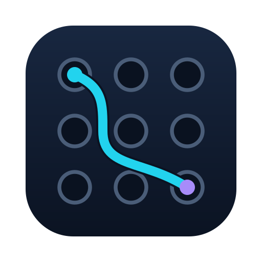
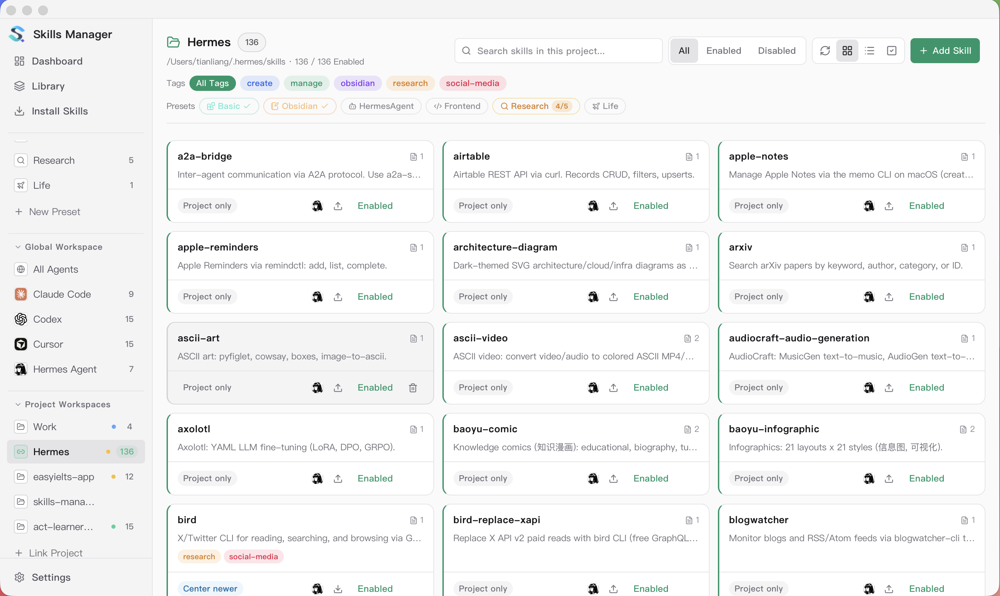
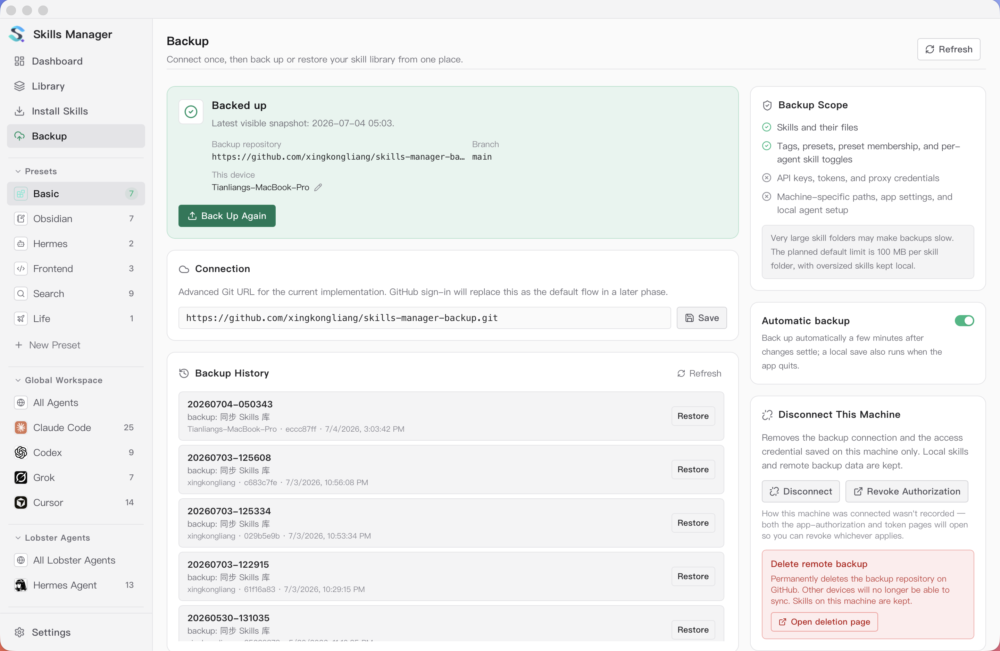
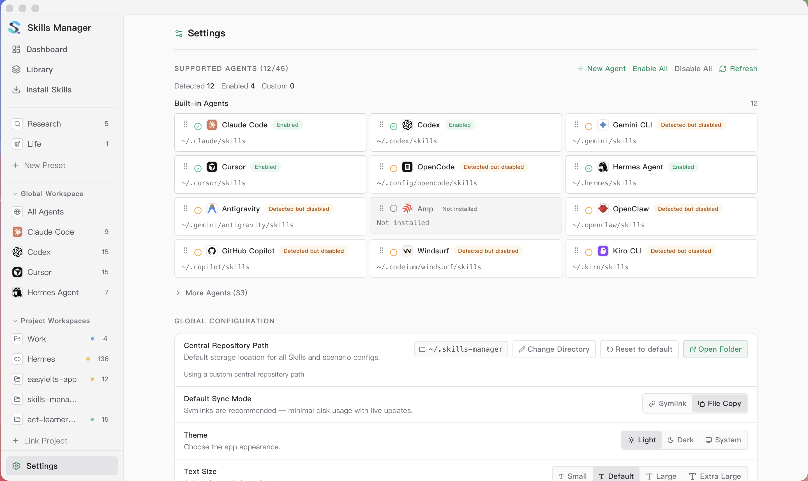
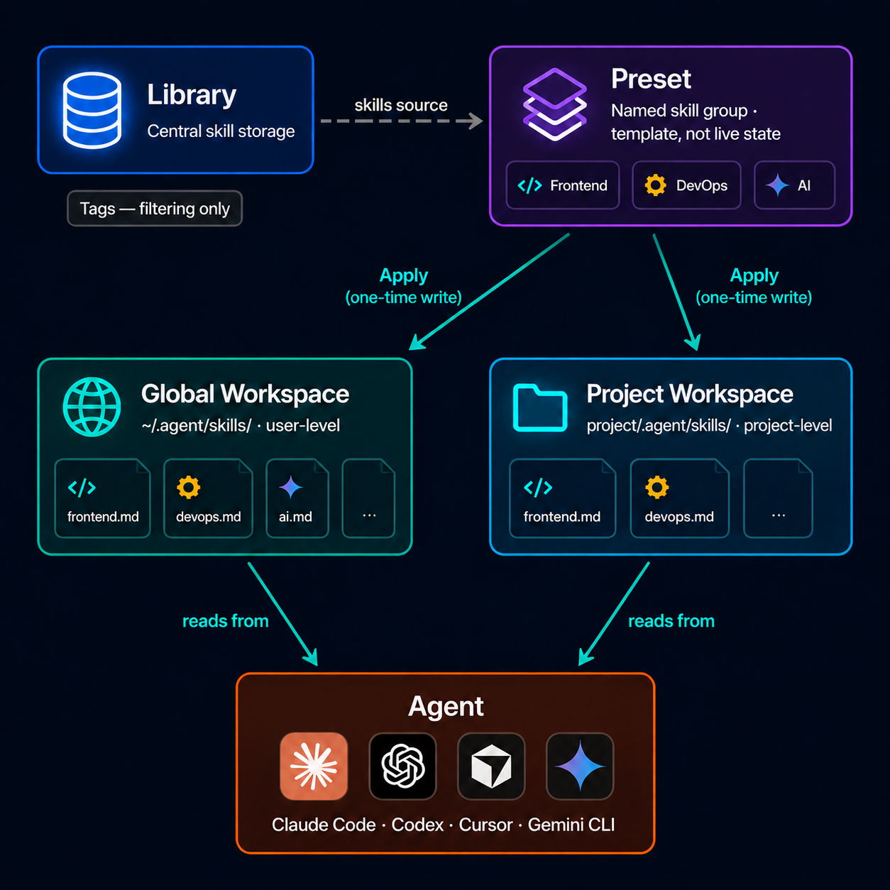

<p align="center">
  
</p>

<h1 align="center">Patchbay</h1>

<p align="center">
  One app to manage AI agent skills across all your coding tools.
</p>

<p align="center">
  🎬 <a href="https://www.youtube.com/watch?v=wfbCrfNASVU">Video intro (YouTube)</a>
  &nbsp;·&nbsp;
  <a href="https://www.bilibili.com/video/BV1845F6REUu/">视频介绍 (Bilibili)</a>
</p>

<p align="center">
  <a href="./README.zh-CN.md">中文说明</a>
  &nbsp;·&nbsp;
  <a href="https://x.com/JayTL00">@JayTL00 on X</a>
  &nbsp;·&nbsp;
  <a href="https://buymeacoffee.com/jaytl">Buy me a coffee</a>
</p>

<p align="center">
  
</p>

<p align="center"><strong>Install Skills — Marketplace</strong></p>
<p align="center"></p>

<p align="center"><strong>Global Workspace</strong></p>
<p align="center"></p>

<p align="center"><strong>Agent Workspace</strong></p>
<p align="center"></p>

<p align="center"><strong>Project Workspace</strong></p>
<p align="center"></p>

<p align="center"><strong>Backup & Multi-Device Sync</strong></p>
<p align="center"></p>

<p align="center"><strong>Settings</strong></p>
<p align="center"></p>

## Project-local Skills — the three-tier model (Patchbay's core)

Patchbay's primary workflow is a strict **three-tier, project-local** Skills system, so an Agent only ever sees the Skills a project actually needs — not your whole library:

1. **Original Repository** — every Skill lives once, in a managed Git checkout under a configured warehouse root.
2. **Project aggregate** — each project exposes only its chosen Skills through `.agents/skills/<skill>` symlinks into those Originals.
3. **Agent entry** — each Agent reaches that project whitelist through its project-local entry surface (`.claude/skills`, `.codex/skills`, …), either as a directory link to `.agents/skills` or per-Skill links.

**Global Agent surfaces are not a distribution tier.** The **Global Guard** keeps `~/.claude/skills` and friends free of real user Skills so stray summaries never consume context or trigger by accident; scanning is read-only until you approve a remediation.

Manage all of this from four connected work areas in the app — **Link Topology**, **Project Links**, **Original Repositories**, and **Doctor** — or from the CLI (`patchbay-cli chain …`), which delegates to the exact same Chain Service and returns stable JSON. Every mutation previews first, applies only explicitly approved symlink / fast-forward-Git changes, and rescans to prove the result. See [docs/xw-three-tier-design.md](docs/xw-three-tier-design.md) for the full model and [docs/xw-three-tier-verification.md](docs/xw-three-tier-verification.md) for the capability-to-ticket map.

> The **central-library / marketplace** features below come from the upstream workflow and remain available for installing and organizing Skills. They are complementary to — and distinct from — the project-only three-tier model above, which is Patchbay's preferred way to expose Skills to Agents per project.

## Features

- **Unified skill library** — Install skills from Git repos, local folders, `.zip` / `.skill` archives, or the [skills.sh](https://skills.sh) marketplace. Everything goes into one central repo, which defaults to `~/.patchbay` and can be customized in **Settings**.
- **Marketplace + AI search** — Browse popular skills from the marketplace, run keyword search, or enable SkillsMP AI search with your API key.
- **Presets** — Group skills into named presets. In any workspace, click a preset pill to instantly activate or deactivate all its skills for the current agent scope. The sidebar lists all presets for quick access.
- **Global Workspace** — Each agent gets its own page listing every skill in its global folder — including ones installed outside Patchbay — so the view always reflects what the agent actually sees. Add or remove skills per agent, or use the All Agents overview to manage every installed agent at once.
- **Project Workspaces** — View and manage project-local skill folders for supported agents, compare them with your central library, and sync changes in either direction. Supports nested skill directories and per-agent assignment when exporting.
- **Instructions governance** — Inspect `AGENTS.md` / `CLAUDE.md` without adding a new workspace: **Link Topology** shows per-agent global instruction cost, **Project Links** adds an Instructions panel with canonical/entry state plus previewed `normalize` / `init` actions, and **Doctor** merges all fourteen instructions rules with the existing chain report. The CLI exposes the same service through `instructions scan / where / doctor / normalize / init`. See the [design](docs/xw-instructions-design.md) and [delivery / release-gate ledger](docs/xw-instructions-verification.md).
- **Linked Workspaces** — Point to any directory as a skills root — useful for skills that live outside the default agent paths. Managed as a standalone workspace without participating in global preset sync.
- **Multi-tool sync** — Sync skills to any supported tool via symlink or copy with a single click. Every skill card shows an agent icon badge per enabled agent — click a badge to install or remove that skill for that agent right from the card, with the badge reflecting live sync state.
- **Add from Library sheet** — In any workspace, click **+ Add Skills** to open a unified picker: search your central library, toggle target agents with always-visible chips (with select-all/clear), and batch-add multiple skills in one click.
- **Batch operations** — Multi-select skills for bulk enable/disable, export, or delete. Project Workspaces also support bulk enable/disable for project-local skills.
- **Skill tagging and filters** — Tag skills, use tags to group similar skills, and filter by source or tag — including an **Untagged** pill to quickly find skills missing labels.
- **Update tracking** — Check for upstream updates on Git-based skills; re-import local ones.
- **Skill preview and source inspection** — Read `SKILL.md` / `README.md`, inspect source metadata, and compare local content with the upstream version inside the app.
- **Custom tools** — Add your own agents/tools with custom skills directories, or override the default path for any built-in tool.
- **Backup & multi-device sync** — Connect a private GitHub repository with one sign-in (or any Git remote), and the app backs your library up automatically and keeps all connected devices in sync. Merges are skill-aware — a rename on one machine combines cleanly with an edit on another — and true conflicts never block: your local version stays put until you choose keep mine / use remote / keep both. Snapshot versions are restorable at any time.
- **Activity log & Export Logs** — Install / remove / update / sync operations are recorded locally. Use **Settings → Export Logs** to bundle recent logs and activity history into a single zip for easier issue reports.
- **Flexible app settings** — Configure repo path, sync mode, theme, text size, language, tray behavior, proxy, Git remote, update checks, and the order agents appear throughout the app — all in one place.

## Core Concepts

<p align="center">
  
</p>

- **Presets are reusable skill groups** — A preset is a named collection of skills. Activate a preset in any workspace to add all its skills to the selected agents; deactivate to remove them. Applying a preset is a one-time copy — not a live sync.
- **Global Workspace manages per-agent global skills** — Each installed agent has its own global skills folder (e.g. `~/.claude/skills/` for Claude Code). Each agent page lists everything in that folder — even skills installed without Patchbay — so you can add, remove, or adopt them; the All Agents overview manages every agent at once.
- **Project Workspaces are project-local skill sets** — A project workspace manages the skills that live inside a specific project (e.g. `<project>/.claude/skills/`). Skills added here only apply to that project.
- **Tags are for grouping and filtering** — Use tags to label similar skills, then filter by tag to find the subset you want quickly.
- **Batch control works everywhere** — Multi-select skills in any workspace for bulk operations.

## Quick Start

1. Install skills from local folders, Git repositories, archives, or the marketplace. If you have a SkillsMP API key, you can also turn on AI search.
2. Open **Global Workspace** from the sidebar and pick an agent (e.g. Claude Code).
3. Click a **Preset** pill to activate its skills for that agent, or use **+ Add Skills** to pick from your library and toggle target agents inline. Active presets show a ✓; partial installs show a count badge.
4. To manage project-local skills, open a **Project Workspace** and use the same preset pills or the **+ Add Skills** picker with its multi-agent target selector.
5. Configure agent paths, custom tools, theme, language, proxy, and Git preferences in **Settings**.
6. If you want history or multi-machine sync, open **Backup** in the sidebar and authorize Patchbay on GitHub — backup and cross-device sync run automatically from then on.

## Backup & Multi-Device Sync

The **Backup** page (sidebar) keeps your skill library versioned in a Git repository. One device gets versioned backup with restorable snapshots; several devices connected to the same repository stay in sync with each other automatically. The remote stays a plain Git repository — you can `git clone` it anywhere, no lock-in.

### Connect

- **Authorize Patchbay on GitHub** (recommended): create or choose a private `patchbay-backup` repository, install the independently owned **Patchbay Backup** GitHub App for that repository only, then authorize the device. First setup uses two short GitHub confirmations: Patchbay identifies and validates the private repository, then GitHub issues the final token with that repository's `repository_id` as a server-enforced limit. Broader or public installations are refused. The App has Contents read/write access only; its short-lived credential is stored in the OS keychain — never in files or the repo config. A personal access token remains available as a fallback.
- **Advanced**: paste any Git URL (HTTPS + PAT, SSH, self-hosted) under **Settings → Git Sync Configuration**.
- On a new machine with an empty library, the first launch asks: **start fresh, or restore from a backup?**

### How syncing works

- **Automatic**: local changes are committed and pushed in the background a couple of minutes after you stop editing; updates pushed by your other devices are merged in and pushed back automatically. **Back Up Now** is always available for an immediate run, and every backup in the history shows which device made it.
- **Skill-aware merging**: changes are merged per skill, not per text line — renaming a skill on one machine combines cleanly with editing its content on another.
- **Conflicts never block or overwrite**: if the same skill was edited on two devices at once, everything else syncs normally while that skill keeps your local version and appears under **Needs attention** (also badged on its card in the Library). Pick **keep mine / use remote / keep both** — a safety snapshot is taken before any choice is applied, so every decision is undoable.
- **Snapshots & restore**: manual backups create snapshot versions; open the Backup page history to restore any of them. A restore first saves the current state as its own snapshot.

### What's included

Skills, tags, presets, and per-agent skill toggles are backed up. Secrets (API keys, tokens, proxy settings) and machine-specific wiring never leave the machine. Skills over 100 MB stay local and are excluded from backup automatically (labeled on the Backup page). The SQLite database is not in Git — it stores metadata that is rebuilt from the skill files.

### Disconnecting

The Backup page offers three levels: **disconnect this machine** (other devices and remote data untouched), **revoke the GitHub authorization**, or **delete the remote backup** entirely (routed through GitHub's own type-the-name confirmation).

## Supported Tools

Cursor · Claude Code · Codex · Grok · OpenCode · Amp · Kilo Code · Roo Code · Goose · Gemini CLI · GitHub Copilot · Windsurf · TRAE IDE · Antigravity · Clawdbot · Droid

You can also add custom tools in **Settings** and manage their skills the same way.

## In-App Help

The **Help** button in **Settings** mirrors the current product flow: recommended workflows, presets, skill installation, the Library (with the Untagged filter and per-card delete), the Global Workspace and the **+ Add Skills** sheet, Project Workspaces with the multi-agent target picker, backup & multi-device sync, and environment-level settings (including Export Logs for issue reports). It is intended as the in-app version of this quick-start guide.

## Tech Stack

| Layer | Tech |
|-------|------|
| Frontend | React 19, TypeScript, Vite, Tailwind CSS |
| Desktop | Tauri 2 |
| Backend | Rust |
| Storage | SQLite (`rusqlite`) |
| i18n | react-i18next |

## Getting Started

### Prerequisites

- Node.js 18+
- Rust toolchain
- [Tauri prerequisites](https://v2.tauri.app/start/prerequisites/) for your OS

### Development

```bash
npm install
npm run tauri:dev
```

### CLI

The repository includes an agent-friendly CLI built on the same Rust shared core used by the desktop app. Both the CLI and the desktop app go through the same SQLite database, central library, and sync engine.

```bash
# Repository / library overview
npm run cli -- repo status
npm run cli -- skills list
npm run cli -- skills show db

# Install skills (default: enter library only — does NOT sync to agents)
npm run cli -- skills install ./my-skill                       # local path
npm run cli -- skills install https://github.com/foo/bar.git   # git URL
npm run cli -- skills install vercel-labs/agent-skills@react-best-practices  # skills.sh
npm run cli -- skills install foo/bar --sync                   # add to active preset + sync to agents

# Update / check from upstream (git skills re-clone, local skills re-import source)
npm run cli -- skills update --all
npm run cli -- skills check --all

# Search the skills.sh marketplace (no API key needed)
npm run cli -- skills search react --limit 5

# Remove (--yes required; --dry-run available)
npm run cli -- skills remove <ref> --dry-run
npm run cli -- skills remove <ref> --yes

# Enable / disable skills by changing preset membership
npm run cli -- presets add-skill <preset> <ref>
npm run cli -- presets remove-skill <preset> <ref>

# Sync the active preset out to enabled agents
npm run cli -- skills sync --dry-run
npm run cli -- skills sync --tool claude_code

# Adopt skills that already exist in an agent directory (e.g. ~/.claude/skills/)
npm run cli -- skills adopt ~/.claude/skills --dry-run
npm run cli -- skills adopt ~/.claude/skills

# Tag
npm run cli -- skills tag add <ref> web frontend
npm run cli -- skills tag list

# Presets
npm run cli -- presets list
npm run cli -- presets preview Default
npm run cli -- presets apply Default
npm run cli -- presets add-skill <preset> <skill>
npm run cli -- presets remove-skill <preset> <skill>

# Export one skill to an arbitrary directory (one-shot copy, not managed)
npm run cli -- skills export db --dest ~/.claude/skills/db

# Git-backed skills repo
npm run cli -- git status
npm run cli -- git pull
npm run cli -- git commit -m "chore: update skills"

# Three-tier chain — diagnose and persist Doctor decisions
npm run cli -- --json chain doctor
npm run cli -- --json chain decide --fingerprint <fp> --action mark-private  # preview
npm run cli -- --json chain decide --fingerprint <fp> --action ignore --apply

# Instructions governance (CLAUDE.md / AGENTS.md) — scan, diagnose, and preview/apply fixes
npm run cli -- instructions scan                       # every registered project
npm run cli -- instructions scan --project /path/to/proj
npm run cli -- instructions where --project /path/to/proj          # per-agent read chain
npm run cli -- instructions where --project /path/to/proj --agent claude
npm run cli -- instructions doctor                                 # findings across all projects + globals
npm run cli -- instructions doctor --project /path/to/proj
npm run cli -- instructions doctor --severity warning --rule dual_body
npm run cli -- instructions normalize --project /path/to/proj      # preview the fix plan
npm run cli -- instructions normalize --project /path/to/proj --fingerprint <fp> --apply
npm run cli -- instructions init --project /path/to/proj           # preview the scaffold
npm run cli -- instructions init --project /path/to/proj --docs-dir --apply
```

Available command groups:
- `repo` — inspect or change the configured base directory
- `tools` — list detected tool targets and paths
- `skills` — manage skills in the central library (`list / show / install / update / check / remove / enable / disable / sync / search / adopt / tag / export`)
- `presets` — list presets, preview / apply, add or remove skills from a preset
- `git` — operate on the git-backed `skills/` repository (`clone`, `pull`, `push`, `commit`, `versions`, `restore`)
- `chain` — inspect and repair the three-tier topology; `decide` records fingerprint-keyed Doctor decisions with `--action mark-private|ignore`, previews by default, and writes only with `--apply`
- `instructions` — instructions-surface tools: `scan` (canonical body, per-agent entry state and resident-set token cost, unmanaged personal layer, global surfaces), `where` (per-agent read chain with import hops), `doctor` (the fourteen governance findings — uninitialized / missing or duplicated bodies / broken imports / oversized bodies / hard-cap risk / skill reconciliation / gitignored entries / global cost — with stable rule ids, `--severity`/`--rule` filters, and fingerprint-keyed ignore), `normalize` (preview→apply the mechanical fixes: promote a trapped body to the canonical, merge a dual body, convert a symlink entry to a wrapper, add a missing wrapper — originals snapshotted, canonical never rewritten, guarded by content TOCTOU + a write-target whitelist), and `init` (preview→apply scaffolding a bare project: the `AGENTS.md` skeleton — never overwritten — the per-agent wrapper entries, and, with `--docs-dir`, an empty `docs/agents/` directory + a pointer in the skeleton; create-only and idempotent)

Extra flags:
- `--skills-root <path>` — operate on a cloned/exported skills repo directly instead of the local app default. The manager's state (DB, presets, cache, logs) lives in `~/.patchbay/external/<name>-<hash>/`, namespaced by the canonical path of the skills root, so the external checkout itself stays clean.
- `--json` — machine-readable output for scripts/agents

```bash
npm run -s cli -- --skills-root /path/to/my-skills --json skills list
```

#### Install the binary on PATH

Agents and scripts that invoke `patchbay-cli` directly (without `npm run`) need the binary on PATH. Install it with:

```bash
npm run cli:install
# equivalent to:
# cargo install --path src-tauri --bin patchbay-cli --locked --force
```

This drops the binary at `~/.cargo/bin/patchbay-cli`. Re-run after pulling updates to refresh it.

#### Concurrent use with the desktop app

The CLI and desktop app share the same SQLite database. SQLite serializes writes safely, but the running app does not auto-refresh its in-memory caches when the CLI mutates state — restart or trigger a manual refresh in the app after `presets apply`, `git pull`, or other CLI write operations.

### App updates

Official macOS builds check the signed Patchbay release channel once per day after startup. A new version is never installed silently: Patchbay shows a persistent prompt, then downloads, verifies, installs, and restarts only after you choose **Install and restart**. You can turn these checks off or run a manual check from Settings; the release-page download remains available as a fallback.

### Build

```bash
npm run tauri:build
npm run cli:build
```

Maintainers: see [RELEASING.md](RELEASING.md) for versioning, signing, notarization, updater, and publication gates.

## Troubleshooting

### macOS: Gatekeeper blocks the app on first launch

Official Patchbay macOS release builds are **Developer ID-signed and notarized**. Gatekeeper should accept an unmodified download from the [Patchbay releases](https://github.com/semantic-craft/patchbay-releases/releases) page.

If an official download is blocked, download it again from that page and report the release tag, macOS version, and exact Gatekeeper message. Do not bypass Gatekeeper or clear quarantine on an official release. Local source builds are a separate development surface and are not expected to carry an Apple notarization ticket.

## License

MIT
