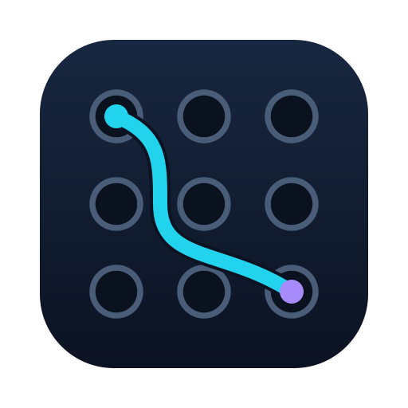

<p align="center">
  
</p>

<h1 align="center">Patchbay</h1>

<p align="center">
  Pick skills from your Git repos and wire them into one project.
</p>

<p align="center">
  <a href="./README.zh-CN.md">简体中文</a>
</p>

## The three-tier chain

Patchbay does one thing: it maintains the chain from your source repositories through a project to each agent's entry point.

```
① Skill sources        ② project .agents/skills      ③ agent entries
Git repositories ─────▶  per-project allowlist ─────▶  .claude/skills
(your own skills)        (symlinks to the source)      .codex/skills …
```

1. **Skill sources** — your own Git repositories. Patchbay reads them; it never copies, hosts, or rewrites them.
2. **Project `.agents/skills`** — one allowlist per project, symlinked back to the source repo. This is where "which skills does this project get" is decided.
3. **Agent entries** — each agent's skills directory points at the project's aggregate layer, so one allowlist serves every agent.

One hard rule goes with it: **global skill surfaces stay empty**. Any skill appearing in `~/.claude/skills`, `~/.codex/skills`, or a sibling directory raises an alarm at the top of the main screen — skills belong to a project, not to a machine.

## Features

- **Workbench** — the main screen. Select a project to see its three-tier state, link and unlink skills, and read the hop-by-hop resolution of every link.
- **Chain view** — a wiring diagram across every source, project aggregate, and agent entry, flagging links that bypass the aggregate layer and links that are broken.
- **Doctor** — rule-driven findings over the chain and instructions, each with evidence, a previewable fix, and an undoable repair record.
- **Sources** — Git health for each source repository (dirty tree, ahead/behind upstream) and duplicate-checkout detection.
- **Instructions governance** — canonical vs. entry status for `CLAUDE.md` / `AGENTS.md`, resident token cost per agent, and preview-then-apply `normalize` / `init`.
- **Fleet** — a cross-machine repository manifest, a status matrix, and guarded push / pull / bootstrap.
- **Presets** — save a set of skills you reach for often and start a new project from it in one step.

## Quick start

1. In **Settings → Original repository roots**, point Patchbay at the directory holding your skill repositories (e.g. `~/Projects/my-skills`).
2. Use **Add project** in the sidebar and select the project you want to wire up.
3. Hit **Link skills** on the workbench, pick the skills and tick the agents to expose them through — Patchbay builds the `.agents/skills` allowlist and each agent's entry.
4. When the banner at the top turns red, open the **Doctor** section for the evidence and a previewed fix.

## Supported agents

Cursor · Claude Code · Codex · Grok · OpenCode · Amp · Kilo Code · Roo Code · Goose · Gemini CLI · GitHub Copilot · Windsurf · TRAE IDE · Antigravity · Clawdbot · Droid

You can also add a custom agent in **Settings** and point it at its own skills directory.

## Tech stack

| Layer | Technology |
|-------|------------|
| Frontend | React 19, TypeScript, Vite, Tailwind CSS |
| Desktop | Tauri 2 |
| Backend | Rust |
| Storage | SQLite (`rusqlite`) under `~/.patchbay` |
| i18n | react-i18next |

## Getting started

### Prerequisites

- Node.js 20.19+, 22.13+, or 24+
- Rust toolchain
- [Tauri prerequisites](https://v2.tauri.app/start/prerequisites/) for your platform

### Development

```bash
npm install
npm run tauri:dev
```

### CLI

`patchbay-cli` shares the desktop app's Rust core and its database, and its `--json` output is the same contract the GUI consumes.

```bash
# Where this machine keeps its data
npm run cli -- --json status

# Detected agents and their skills directories
npm run cli -- tools list

# Three-tier chain — scan, diagnose, persist Doctor decisions
npm run cli -- --json chain topology
npm run cli -- --json chain doctor
npm run cli -- --json chain decide --fingerprint <fp> --action ignore          # read-only preview
npm run cli -- --json chain decide --fingerprint <fp> --action ignore --apply

# Instructions governance (CLAUDE.md / AGENTS.md)
npm run cli -- instructions scan
npm run cli -- instructions where --project /path/to/proj --agent claude
npm run cli -- instructions doctor --severity warning --rule dual_body
npm run cli -- instructions normalize --project /path/to/proj                  # preview the fix plan
npm run cli -- instructions normalize --project /path/to/proj --fingerprint <fp> --apply
npm run cli -- instructions init --project /path/to/proj --docs-dir --apply

# Fleet: status matrix and guarded sync
npm run cli -- --json fleet status
npm run cli -- --json fleet push --apply
```

Command groups:

- `status` — this machine's data directory and database path
- `tools` — detected agent targets and paths
- `chain` — inspect and repair the three-tier chain; `decide` persists a Doctor decision by fingerprint (`--action mark-private|ignore`), previewing by default and writing only with `--apply`
- `instructions` — `scan` (canonical file, per-agent entry status, resident token cost), `where` (per-agent read chain including import hops), `doctor` (fourteen governance rules with stable ids, `--severity`/`--rule` filters, and fingerprint-based ignores), `normalize` (preview→apply mechanical fixes, snapshot before write, canonical file never rewritten), `init` (preview→apply scaffolding, create-only and idempotent)
- `fleet` — cross-machine manifest, status matrix, and push / pull / bootstrap, all preview→apply

`--json` gives machine-readable output for scripts and agents.

#### Install the binary on PATH

```bash
npm run cli:install
# equivalent to:
# cargo install --path src-tauri --bin patchbay-cli --locked --force
```

This drops the binary at `~/.cargo/bin/patchbay-cli`. Re-run after pulling updates to refresh it.

#### Concurrent use with the desktop app

The CLI and desktop app share the same SQLite database. SQLite serializes writes safely, but the running app does not auto-refresh its in-memory caches when the CLI mutates state — hit **Rescan** in the app after a CLI write.

### App updates

Official macOS builds check the signed Patchbay release channel once per day after startup. A new version is never installed silently: Patchbay shows a persistent prompt, then downloads, verifies, installs, and restarts only after you choose **Install and restart**. You can turn these checks off or run a manual check from Settings; the release-page download remains available as a fallback.

### Build

```bash
npm run tauri:build
npm run cli:build
```

Maintainers: see [RELEASING.md](RELEASING.md) for versioning, signing, notarization, updater, and publication gates.

## Troubleshooting

### macOS: Gatekeeper blocks the app on first launch

Official Patchbay macOS release builds are **Developer ID-signed and notarized**. Gatekeeper should accept an unmodified download from the [Patchbay releases](https://github.com/semantic-craft/patchbay-releases/releases) page.

If an official download is blocked, download it again from that page and report the release tag, macOS version, and exact Gatekeeper message. Do not bypass Gatekeeper or clear quarantine on an official release. Local source builds are a separate development surface and are not expected to carry an Apple notarization ticket.

## License

MIT
